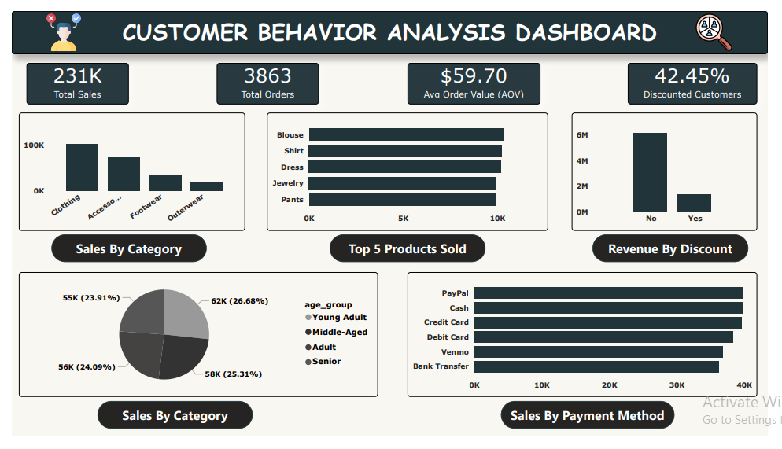

# ✅ Customer Trend & Behavior Analysis – End-to-End Data Project

📌 Project Overview
This project analyzes customer purchasing behavior using a realistic, industry-style data pipeline:

✅ Load raw dataset into SQL

✅ Clean & transform using SQL + Python

✅ Perform Exploratory Data Analysis (EDA)

✅ Reload the cleaned dataset into SQL

✅ Build an interactive Power BI dashboard for insights

This workflow simulates how data moves in real analytics environments used in companies.

🎯 Business Goal
To identify:
Which products and categories drive revenue
How discounts influence customer behavior
What customer segments purchase the most
Payment preferences and seasonal trends
Key metrics that support business decisions

## 🧩 Project Structure

```text
10.CUSTOMER_TREND_ANALYSIS
│
├── Datasets
│   └── customer_shopping_behavior.csv
│
├── Docs
│   ├── Business Problem Document.pdf
│   └── Customer Shopping Behavior Analysis.pdf
│
├── Notebooks
│   └── Data_Import_And_EDA.ipynb
│
├── Power BI Dashboard
│   ├── Customer_Behavior_Analysis.pbix
│   └── Customer_Behavior_Analysis.pdf
│
├── SQL EDA
│   └── EDA_And_Knowing_The_Dataset.sql
│
└── img
    ├── dashboard.png
    ├── sales_by_category.png
    ├── top_products.png
    ├── payment_method.png
    └── age_group.png
```

> **Note:** The `img` folder contains all dashboard screenshots used in this README.

🛠️ Tech Stack
Phase	Tools Used
Database	MySQL
Cleaning & EDA	Python (Jupyter Notebook), SQL
Visualization	Power BI
Documentation	PDF, GitHub

📥 1️⃣ Data Import into SQL
Designed MySQL database schema
Selected appropriate data types
Imported raw CSV into SQL tables
✅ Real-world skill gained: Database structuring & data ingestion

🧹 2️⃣ Data Cleaning & Transformation
Performed using SQL + Python:
Renamed inconsistent columns
Fixed spacing & formatting issues
Standardized categorical values
Created derived features like age_group
Segmented customers using previous_purchases

Example SQL fix:
ALTER TABLE fact_customer_behavior 
CHANGE `Age Group` age_group VARCHAR(20);

## 🔎 3️⃣ Exploratory Data Analysis (EDA)
Conducted in `Data_Import_And_EDA.ipynb`. Key steps included:
* Generating summary statistics.
* Analyzing value distributions.
* Identifying category behavior patterns.
* Comparing Discount vs. Non-Discount purchases.
* Extracting product-level insights.

> **✅ Real-world skill gained:** Insight discovery from raw data.

---

## 📤 4️⃣ Export & Reload to SQL
After cleaning and exploration, the transformed dataset was exported and reloaded into MySQL to prepare for seamless BI tool integration.

> **✅ Real-world skill gained:** Analytics pipeline thinking.

---

## 📊 5️⃣ Power BI Dashboard

### 📌 Customer Behavior Analysis Dashboard
**Key Metrics Displayed:**
* **Total Sales:** $231K
* **Total Orders:** 3,863
* **Average Order Value (AOV):** $59.70
* **Discounted Customers:** 42.45%

### 📈 Dashboard Visuals & Insights
* **Sales by Category:** Visualizing revenue drivers.
* **Top 5 Products Sold:** Identifying best-sellers.
* **Revenue by Payment Method:** Understanding transaction preferences.
* **Age Group Distribution:** Demographics analysis.

> **✅ Real-world skill gained:** Business storytelling with visuals.



---

## ⭐ Key Insights
* **Revenue Driver:** Clothing drives the highest revenue among all categories.
* **Consumer Behavior:** Almost half (42.45%) of customers rely on discounts to make a purchase.
* **Payments:** PayPal & Credit Card dominate the payment landscape.
* **Demographics:** Young adults form the largest buying segment.
* **Spending:** The AOV of $59.70 suggests medium-ticket purchases are the norm.

---

## 🚀 Key Learnings
Through this project, I gained practical experience in:
* Writing **SQL** for cleaning & transformation.
* Using **Python** for statistical EDA.
* Designing **Power BI** dashboards for stakeholders.
* Building a structured **data pipeline**.
* Turning raw data into **business insights**.

---

## 🔜 Next Steps
* Add **Cohort Analysis** & **RFM Analysis**.
* Publish the dashboard online (Power BI Service).
* Explore **Predictive Modeling** (Customer Churn / CLV).

---

## 🏁 Conclusion
This project showcases a complete, end-to-end analytics workflow — starting from raw data and ending with actionable insights. It reflects real industry practices used by data analysts and data engineers to drive business value.

🔗 Connect With Me
LinkedIn: www.linkedin.com/in/imranfakji9764267487
GitHub: https://github.com/imranfakji/Customer-Shopping-Behavior-Analysis
